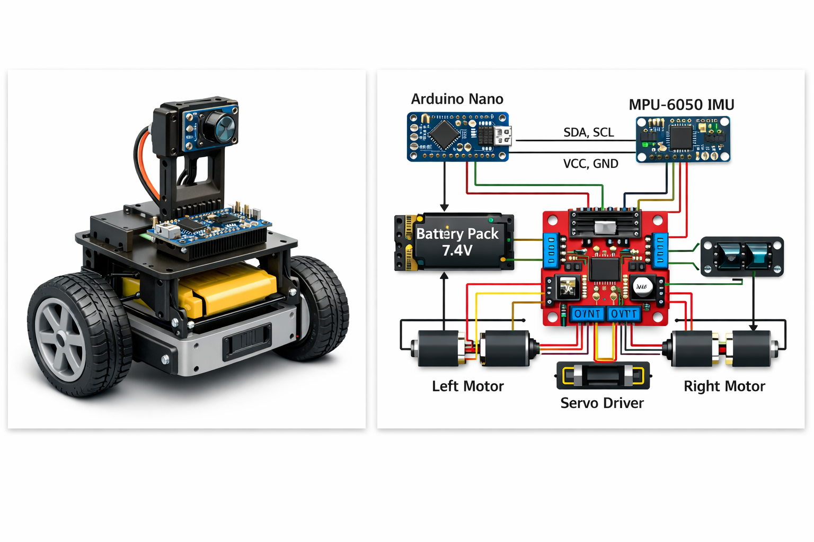

# Papaya Mini Rover (ESP32 Rover)

## Overview
Papaya Mini Rover is a compact, open-source rover designed around the ESP32 microcontroller. It features a six-wheel rocker-bogie suspension for excellent off-road capability, fully 3D-printable body panels and a choice of control methods — Wi-Fi FPV via the ESP32-CAM or long-range ExpressLRS. The design uses six N20 gear motors and a lightweight 2-s Li-ion battery pack, making it agile yet robust.

## Motivation
Rovers are a fun way to explore mechanical design and wireless control. Existing designs are often proprietary or difficult to customize. This project aims to provide a fully open mechanical and electrical design that anyone can build with common parts and a 3D printer. Inspired by the larger Papaya Pathfinder platform, the mini rover brings the same rocker-bogie suspension to a palm-sized vehicle.

## How to Use

1. **Print the parts** – The chassis, suspension arms and wheel hubs are all provided as STL files. Print them in PLA or PETG with 0.2 mm layer height. Some parts may require supports.
2. **Assemble the frame** – Install the six N20 gear motors into the rocker arms, attach the wheel hubs and wheels, and join the two rocker sides with the central bogie pivot. Secure everything with M3 hardware.
3. **Electronics** – Mount the ESP32-CAM (or S3-CAM) module and two L9110S dual motor drivers. Wire each motor driver to three N20 motors (left and right sides). Connect the Li-ion battery pack through a DC-DC step-up regulator.
4. **Firmware** – Upload the provided Arduino sketch to the ESP32. The code sets up a Wi-Fi access point and streams video while accepting joystick commands via a web interface. For ExpressLRS, use the corresponding configuration and connect a receiver to the ESP32’s UART pins.
5. **Drive** – Connect to the rover’s Wi-Fi network or ExpressLRS receiver and drive your rover! The rocker-bogie suspension enables it to climb over small obstacles and handle uneven terrain.

## File Organization

- **images/** – Conceptual renders of the rover. Replace these with screenshots of your CAD model and assembly.
- **firmware/** – ESP32 code for Wi-Fi streaming and motor control.
- **BOM.csv** – Detailed bill of materials with links to purchase each part.
- **model.step** – STEP model placeholder for the assembled rover. Export your CAD assembly as a STEP file and replace this.

## Pictures

Below are images of the completed rover:

*Figure 1. Rendered CAD assembly*

*Figure 2. Wiring diagram*

## Bill of Materials

| Item | Quantity | Link |
| --- | --- | --- |
| ESP32-CAM module | 1 | [Amazon link](https://www.amazon.com/dp/B0869NTGR9) |
| L9110S Dual Motor Driver Board | 2 | [Amazon link](https://www.amazon.com/dp/B08ZXXV59C) |
| N20 Gear Motor with 40 mm Wheel | 6 | [Amazon link](https://www.amazon.com/dp/B07R32W3WD) |
| 2s Li-ion (7.4 V) Battery Pack | 1 | [Amazon link](https://www.amazon.com/dp/B082MP7K1H) |
| M3 Screws and Nuts | 1 set | [Amazon link](https://www.amazon.com/dp/B06XFS5651) |
| Rocker-Bogie Suspension 3D Prints | as required | – |
| Power Switch and Wiring | as required | – |

## License

This project is licensed under the MIT License. See the [LICENSE](LICENSE) file for details.
